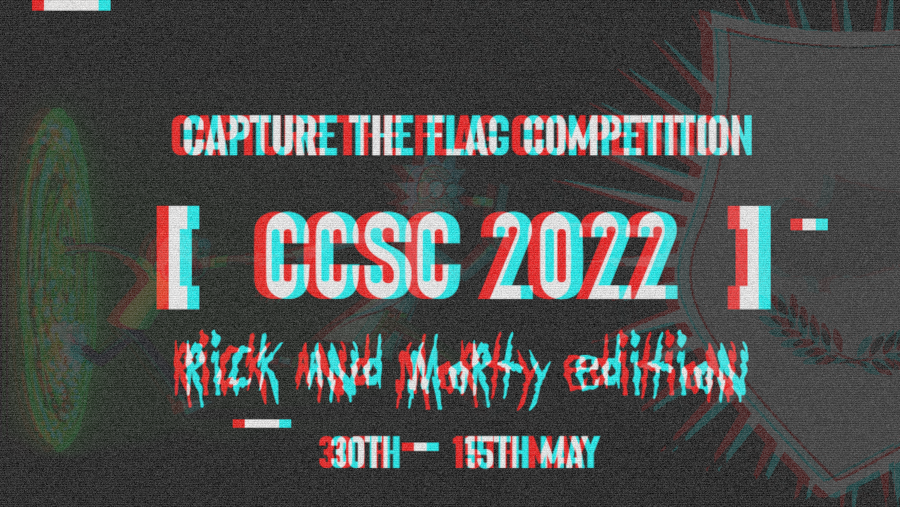

# CCSC-CTF-2022

## Repository Structure

This is the official repository with the challenges published in CCSC CTF 2022. Each challenge has a `public` and `setup` folder (if applicable) and is accompanied with a short description. The `setup` folder contains all the files required to build and host the challenge and usually contains the flag and a proof of concept solution as well. Alternatively, the `public` folder contains the files that are released to the participant during the competition.

## Dependencies

Although some of the challenges may run as is, it is recommended that you have **docker** and **docker-compose** installed and use the provided scripts to run the challenges to ensure isolation and therefore proper environment setup.

For a more detailed description of the folder structure for challenges, please see the [Jeopardy Creation Guide](https://www.notion.so/Jeopardy-CTF-Challenge-Creation-770b62e8556442a3826cb6593d6affa4) on the Cybermouflons wiki.

## Reserved Ports

Port 8000 will be used for serving static artifacts

### Challenges

### Crypto

| Name                                                             | Author    | Ports |
| ---------------------------------------------------------------- | --------- | ----- |
| [Cathode Ray Thruster](crypto/cathode-ray-thruster)              | rok0s     | 9000  |
| [Supersingular Finite Curve](crypto/supersingular-finite-curve/) | rok0s     | -     |
| [Get Schwifty](crypto/get_schwifty)                              | R3D       | 3137  |
| [Rick Derivation Functions](crypto/Rick_Derivation_Functions)    | tratrafe2 | -     |
| [Dimension SECP-256K](crypto/dimension-secp-256k/)               | rok0s     | -     |

### Forensics

| Name                                                   | Author      | Ports |
| ------------------------------------------------------ | ----------- | ----- |
| [FakeDoor](forensics/FakeDoor/)                        | icyDux      | -     |
| [Ricklantis](forensics/ricklantis/)                    | anderson101 | -     |
| [The Citadel of Ricks](forensics/the_citadel_of_ricks) | R3D         | -     |
| [SumoRick I](forensics/SumoRick_I)                     | tratrafe2   | -     |
| [SumoRick II](forensics/SumoRick_II)                   | tratrafe2   | -     |
| [BirdLanguage](forensics/BirdLanguage)                 | icyDux      | 9001  |

### Misc

| Name                                        | Author  | Ports |
| ------------------------------------------- | ------- | ----- |
| [Pickle Rick](misc/pickle-rick)             | rok0s   | -     |
| [CUBIK RICK](misc/CUBIK_RICK)               | R3D     | 6910  |
| [Pokemon Adventure](misc/Pokemon-Adventure) | s1kk1s  | -     |
| [Ricky's Pass](misc/rickys-pass/)           | kotsios | -     |

### Reverse

| Name                                         | Author             | Ports |
| -------------------------------------------- | ------------------ | ----- |
| [Rickompression](reverse/Rickompression)     | tratrafe2 / Icydux | -     |
| [Z3ep Xanflorp I](reverse/Z3ep_Xanflorp_I)   | tratrafe2 / Icydux | 1234  |
| [Z3ep Xanflorp II](reverse/Z3ep_Xanflorp_II) | tratrafe2 / Icydux | 1235  |
| [Z3ep Xanflorp III](reverse/Z3ep_Xanflorp_III) | tratrafe2 / Icydux | 10002  |
| [Tempting Fate](reverse/tempting-fate/)      | ishtar             | -     |
| [ArtPixel](reverse/ArtPixel/)                | icyDux             | -     |

### Stego

| Name                               | Author | Ports |
| ---------------------------------- | ------ | ----- |
| [UFO](stego/ufo)                   | koks   | -     |
| [Meeting Area](stego/meeting-area) | koks   | -     |

### Web

| Name                                     | Author | Ports |
| ---------------------------------------- | ------ | ----- |
| [Planet-TC39](web/planet-tc39)           | koks   | 3000  |
| [Morty's Cleanup List](web/morty's-list) | s1kk1s | 5000  |
| [Portal Gun](web/portal-gun/)            | rok0s  | 8082  |
| [Unity](web/unity)                       | styx00 | 5001  |
| [Alien Gems](web/alien-gems)             | koks   | 3000  |
| [MOrty'S Injection](web/mortys-injection/)    | kotsios | 5051  |
| [Morty in the Clink](web/morty-in-the-clink/) | kotsios | 5052  |

### Pwn

| Name                                               | Author  | Ports |
| -------------------------------------------------- | ------- | ----- |
| [Meeseeks and Destroy](pwn/custom_heap_allocator)  | condiom | 1337  |
| [Total Rickvenge](pwn/automated_pwn)               | condiom | 1338  |
| [babytcache](pwn/babytcache)                       | s3nn    | 2337  |
| [rickrop](pwn/rickrop)                             | s3nn    | 3337  |
| [forking](pwn/forking)                             | alex    | 4337  |
| [league-of-ricks](pwn/league-of-ricks)             | neo     | 5337  |
| [nohook](pwn/nohook)                               | s3nn    | 6337  |
