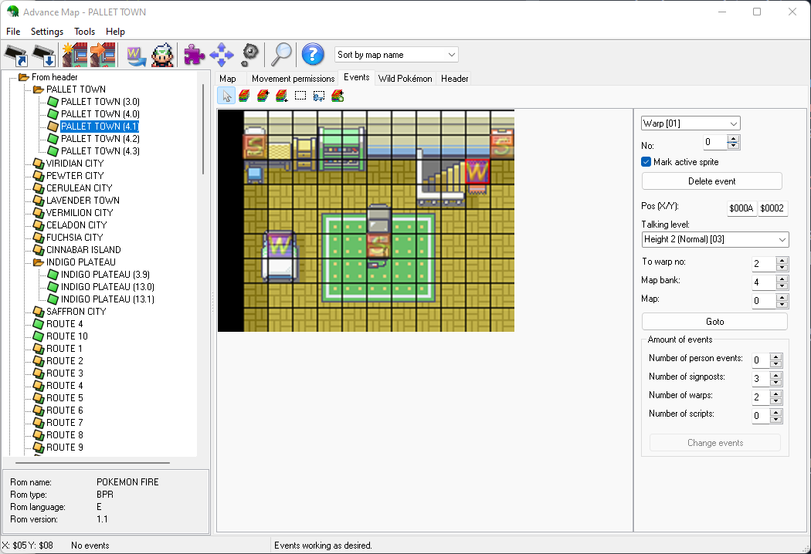
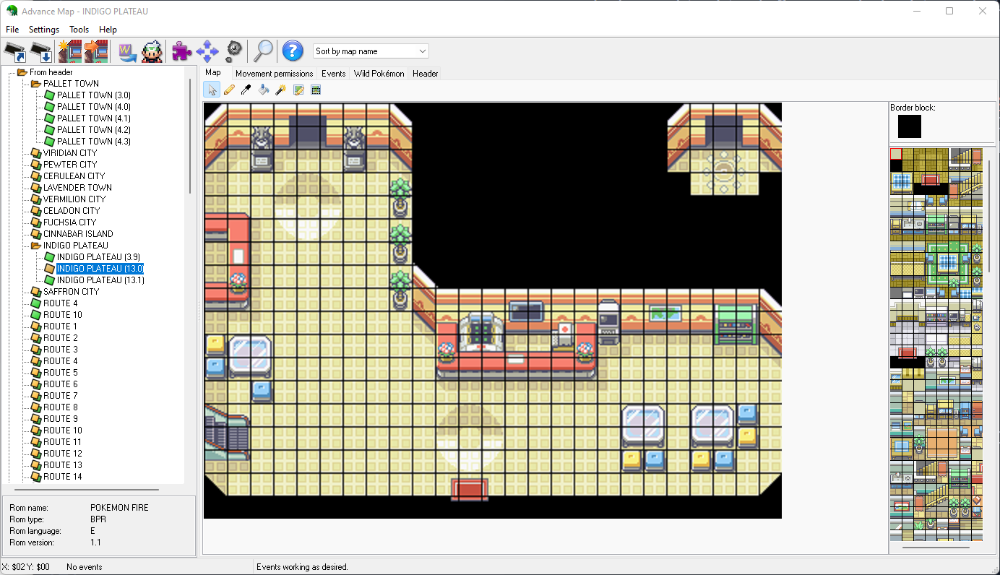
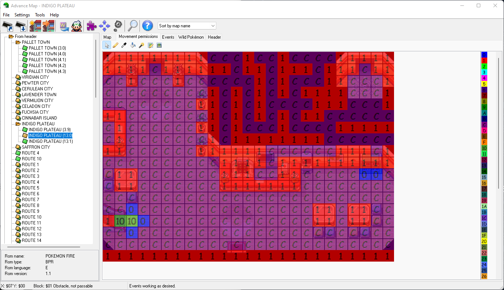
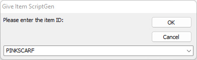

# Pokemon Adventure

**Category**: Misc

**Author**: s1kk1s

## Description
Rick and Morty wild adventures do not care about copyright strikes! This time they infiltrated POKEMON! Can you find Rick and win the game?

Reveal Spoiler

Using the [advance map](https://www.pokemonhacking.com/gba-hack-tools/advance-map/) and visiting Map PALLET TOWN(4.1) an Event is created that wraps the user to map INDIGO PLATEAU (13.0).

By selecting the tab Movement permisions a path is created which allows the user to access the secret door on the right.

A Wrap event is triggered which teleports the user to a room which can aquire Mew! Finally by visiting "Rick", he is given an encrypted message which is decoded by XORing the encoded message with the name of the item that Mew holds. 

The correct name of the item is from the Script Generator used to embed the new dialog in the game [pksvui](https://sourceforge.net/projects/pk-script-view/).

### Solution
Base64 decode message: `EwodCCgiJzR/NCh8eGp6c2YjNn13KWsldmZyNix3fWZwd2B1YH93c2Nyc2RzLQ==` and XOR it with UTF8 KEY `PINKSCARF`. 

`CCSC{aff9da239924ef49b8f744fe9653623069801265}`

