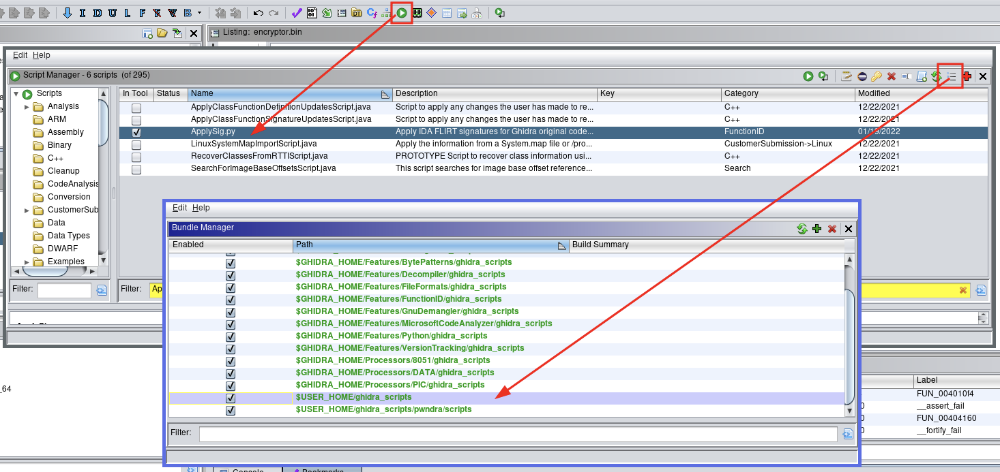

checksec:
```
Arch:     amd64-64-little
RELRO:    Partial RELRO
Stack:    No canary found
NX:       NX enabled
PIE:      No PIE (0x400000)
```

file:
```
./encryptor.bin: ELF 64-bit LSB executable, x86-64, version 1 (SYSV), statically linked, BuildID[sha1]=b0066b2a0185e1ef90f89249675e466b550dd7f5, for GNU/Linux 4.4.0, stripped
```

As it is not a binary exploitation challenge, the following are useful:
- SYSV x86-64 (calling convention)
- statically linked
- stripped (no symbols)

readelf:
```
ELF Header:
  Magic:   7f 45 4c 46 02 01 01 00 00 00 00 00 00 00 00 00
  Class:                             ELF64
  Data:                              2's complement, little endian
  Version:                           1 (current)
  OS/ABI:                            UNIX - System V
  ABI Version:                       0
  Type:                              EXEC (Executable file)
  Machine:                           Advanced Micro Devices X86-64
  Version:                           0x1
  Entry point address:               0x401670
  Start of program headers:          64 (bytes into file)
  Start of section headers:          726736 (bytes into file)
  Flags:                             0x0
  Size of this header:               64 (bytes)
  Size of program headers:           56 (bytes)
  Number of program headers:         10
  Size of section headers:           64 (bytes)
  Number of section headers:         30
  Section header string table index: 29
```

As the binary is non PIE, the entry point address will always be at 0x401670.

Loading the binary into Ghidra and jumping to the entrypoint we see something similar to the following:

```asm
                    entry
00401670 f3 0f 1e fa     ENDBR64
00401674 31 ed           XOR        EBP,EBP
00401676 49 89 d1        MOV        R9,RDX
00401679 5e              POP        RSI
0040167a 48 89 e2        MOV        RDX,RSP
0040167d 48 83 e4 f0     AND        RSP,-0x10
00401681 50              PUSH       RAX
00401682 54              PUSH       RSP=>local_10
00401683 49 c7 c0        MOV        R8=>FUN_00403fa0,FUN_00403fa0
         a0 3f 40 00
0040168a 48 c7 c1        MOV        RCX=>__libc_csu_fini,__libc_csu_fini ; renamed
         00 3f 40 00
00401691 48 c7 c7        MOV        RDI=>main,main      ; renamed
         95 17 40 00
00401698 67 e8 f2        CALL       __libc_start_main   ; renamed
         13 00 00
0040169e f4              HLT
```

As `__libc_start_main()` expects the address of the `main()` function as its first argument, we know that `RDI` register contains the address of `main()`. Therefore let's rename them as above.

The rest of the code seems difficult to understand. Running `strings` on the given `encryptor.bin` binary we can gain some information, that the binary indeed is statically linked with `libc` library.

```bash
$ strings ./encryptor.bin | grep libc | sort -u
...
__libc_atexit
__libc_calloc
__libc_early_init
__libc_freeres_fn
__libc_freeres_ptrs
__libc_IO_vtables
__libc_malloc
__libc_realloc
libc.so.6
__libc_start_main
...
```

x86-64 syscall table: https://filippo.io/linux-syscall-table/
F.L.I.R.T: https://github.com/NWMonster/ApplySig/blob/master/ApplySig.py
F.L.I.R.T signature database: https://github.com/push0ebp/sig-database

Running the aforemention Ghidra "plugin" (ApplySig) and providing libc6\_2.31-0ubuntu9\_amd64.sig as input, the disassembly is now more clear.



Moving to the `main()` function, we can see a normal function prologue. A stack frame is created and 0x30 (=48) bytes are reserved on the stack for local variables. We know that the main function has to be declared as `int main(int argc, char **argv)`, as it is accepting two arguments - the source file and the destination file.

```asm
                    main  
00401795 55              PUSH       RBP
00401796 48 89 e5        MOV        RBP,RSP
00401799 48 83 ec 30     SUB        RSP,0x30
0040179d 89 7d dc        MOV        dword ptr [RBP + local_2c],EDI
004017a0 48 89 75 d0     MOV        qword ptr [RBP + local_38],RSI
004017a4 64 48 8b        MOV        RAX,qword ptr FS:[0x28]
        04 25 28 
        00 00 00
004017ad 48 89 45 f8     MOV        qword ptr [RBP + local_10],RAX
004017b1 31 c0           XOR        EAX,EAX
004017b3 83 7d dc 03     CMP        dword ptr [RBP + _argc],0x3
004017b7 74 0f           JZ         LAB_004017c8
004017b9 e8 c9 01        CALL       FUN_00401987
         00 00
004017be bf 01 00        MOV        argc,0x1
         00 00
004017c3 e8 08 7e        CALL       FUN_004095d0        ; exit
         00 00

```

The number of arguments (`argc`) is copied from `EDI` (4 bytes => int) to a local variable and the arguments pointer (`argv`) is also copied to a local variable from `RSI` register (8 bytes => pointer). Later it is checked whether the provided arguments are equal to three (3) and exits if it doesnt.

Moving forward, the label `LAB_00401850` skipping label `LAB_004017c8` which handles the opening of the first argument, we can see the relevant disassembly for opening the destination file given as argument to the `encryptor.bin` binary and held in `argv[2]`.

```asm
                    LAB_00401850 
00401850 e8 8b 27        CALL       FUN_00403fe0                    ; this is the return code of the previous
            00 00                                                   ; function, but it was not identified by Ghidra
00401855 c7 00 00        MOV        dword ptr [RAX],0x0
            00 00 00
0040185b 48 8b 45 d0     MOV        RAX,qword ptr [RBP + _argv]      ; argv
0040185f 48 83 c0 10     ADD        RAX,0x10                         ; argv[2]
00401863 48 8b 00        MOV        RAX,qword ptr [RAX]              ; *argv[2]
00401866 ba 80 01        MOV        EDX,0x180
            00 00
0040186b be 41 02        MOV        argv,0x241                       ; RSI = O_TRUNC | O_CREAT | O_WRONLY
            00 00
00401870 48 89 c7        MOV        argc,RAX                         ; RDI
00401873 b8 00 00        MOV        EAX,0x0
            00 00
00401878 e8 93 e3        CALL       __open                           ; open(argv[2], O_TRUNC | O_CREAT 
            03 00
```

I will skip the parts responsible for error handling for brevity and let's jump into the next part of the encrypter logic.

```asm
XREF[1]: 0043f422(j)  
                   LAB_0043f434                                    
0043f434 48 89 ef        MOV        RDI,RBP
0043f437 b8 c9 00        MOV        EAX,0xc9
         00 00
0043f43c 0f 05           SYSCALL
```

Searching for syscall number 0xc9 (= 201) we see that this function is actually `time()`

```asm
XREF[1]: 00401884(j)  
                    LAB_0040189f
0040189f bf 00 00        MOV EDI,0x0
         00 00
004018a4 e8 67 db        CALL __time    ; renamed from FUN_0043f410
         03 00
```

So, the above code just calls `time(NULL)`, which according to the manual (`man 2 time`) it returns the number of seconds since the Epoch, 1970-01-01 00:00:00 +0000 (UTC).

```asm
XREF[1]: 00401884(j)  
                    LAB_0040189f
0040189f bf 00 00        MOV        EDI,0x0
         00 00
004018a4 e8 67 db        CALL       __time
         03 00
004018a9 89 c7           MOV        EDI,EAX
004018ab e8 b0 7f        CALL       __random
         00 00
```

Moving forward, the code copies the return value from calling `time(NULL)` - a.k.a the number of seconds since epoch, to `EDI` register - a.k.a the first parameter in the x64 SYSV calling convention, to `random()`.
According to the manual (`man 3 random`) the only function that takes a numerical value as its only parameter is actually `srandom()`, which sets the initial `seed` value.

I will skip the parts that read from input file and write to output file, as are easy to spot. Let's move to the transformation logic of the encrypter:

```asm
                    xor_with_random_value 
00401ad0 55              PUSH       RBP
00401ad1 48 89 e5        MOV        RBP,RSP     ; stack frame
00401ad4 48 83 ec 10     SUB        RSP,0x10    ; 16 byte stack space
00401ad8 89 f8           MOV        EAX,EDI     ; eax = passed int (argument)
00401ada 88 45 fc        MOV        byte ptr [RBP + local_c],AL ; store eax & 0xff in [rbp - 0xc]
00401add e8 ce 84        CALL       rand        ; eax = rand()
            00 00
00401ae2 89 c2           MOV        EDX,EAX
00401ae4 0f b6 45 fc     MOVZX      EAX,byte ptr [RBP + local_c]
00401ae8 31 d0           XOR        EAX,EDX     ; a ^= b
00401aea c9              LEAVE                  ; epilogue
00401aeb c3              RET                    ; return eax = (a ^ b)
```

Here, `xor_with_random_value()` performs an XOR operation with a random value generated via a call to `rand()` function for each value that was read from the input file.

As `rand()` is not a cryptographically secure PRNG function, returns always the same sequence given the analogous seed value (a.k.a reproducible results - for this reason, `srand()` is commonly used for simulations).

From the file's metadata (creation/modification time kept by the filesystem - see `lstat(2)`) we can write a solver script to recover the original form.

```c
#include <stdio.h>
#include <time.h>
#include <stdlib.h>
#include <string.h>
#include <stdint.h>
#include <sys/stat.h>
#include <errno.h>

int try_decrypt(long, char *, char *, size_t);

int main(int argc, char *argv[])
{
    // return code
    int ret = 0; 
    int found = 0;
    char dec[] = "CCSC2022";  // known plaintext
    size_t dec_len = strlen(dec) - 1;
    char buf[dec_len];

    if (argc != 2) {
        fprintf(stderr, "Usage: solve <input-file>\n");
        return -1;
    }

    // open encrypted file
    errno = 0;
    FILE *fin = fopen(argv[1], "rb");
    if (NULL == fin) {
        perror("fopen");
        return EXIT_FAILURE;
    }

    // find modification time in seconds
    struct stat st;
    errno = 0;
    ret = lstat(argv[1], &st);
    if (ret < 0) {
        perror("lstat");
        ret = EXIT_FAILURE;
        goto err;
    }

    // read first len bytes (known plaintext length)
    fread(buf, sizeof(char), dec_len, fin);
    if (ferror(fin) != 0) {
        perror("fread");
        ret = EXIT_FAILURE;
        goto err;
    }

    // modification time in seconds
    long seed_start = st.st_mtim.tv_sec;
    printf("[#] Trying seed: %lu\n", seed_start);

    found = try_decrypt(seed_start, buf, dec, dec_len);
    if (found) {
        // initialize PRNG
        (void)srand(seed_start);
      
        // decrypt
        int c;
        (void)rewind(fin);
        while (fread(&c, sizeof(char), 1, fin) != 0) {
            c ^= (char)rand();
            putchar(c);
        }
    }

err:
    fclose(fin);
    return ret;
}

int try_decrypt(long seed, char *enc, char *dec, size_t len)
{

    (void)srand(seed);

    char c;
    for (size_t i = 0; i < len; i++) {
        c = enc[i] ^ (char)rand();
        if (dec[i] != c) { return 0; }
    }

    return 1;
}
```